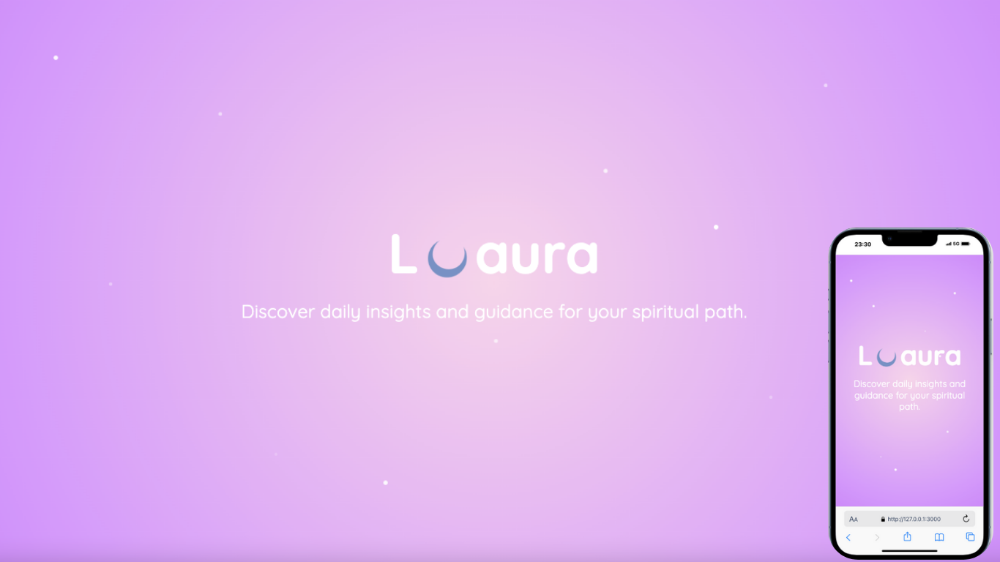

# 🌙 Responsive Mystic Website with Interactive Tarot (Daily Tarot)



This website, developed using **HTML**, **CSS**, and **JavaScript**, was created to explore esoteric topics such as **Tarot** and **Vedic Astrology**.

The design was first conceptualized using **Figma** and **Canva**. The name **"Luaura"** is a creative blend of the word *"Lua"* (which means *Moon* in Portuguese) and *Aura*, symbolizing the mystical and intuitive energy of the moon.

To reflect a magical atmosphere, the first section features twinkling stars animated with pure CSS. The site is divided into sections: **Articles**, **Daily Tarot**, **Shop**, and a **Footer** with links to social media.

✨ But the most fun feature is the **Interactive Daily Tarot**, coded in JavaScript. With just one click, a random tarot card is drawn along with a unique daily message. 

To ensure the experience stays true to the “daily” concept, each user receives **only one card per day**. This is achieved using the following logic:

```javascript
if (savedCard) {
  return;
}
localStorage.setItem(`tarotCard_${today}`, cardName);
